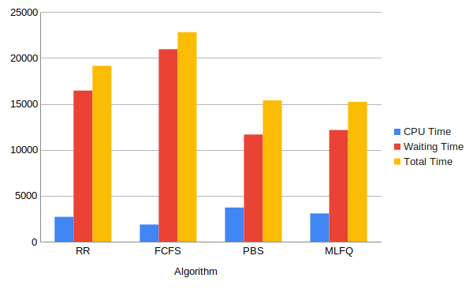
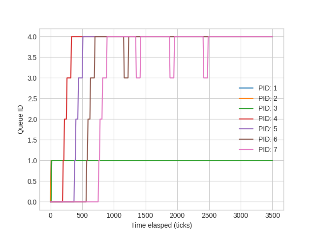

# Assignment-5
> By Ashwin Mittal

## Task-1

### waitx system call
```vim
int waitx(int* wtime, int* rtime)
```
The two arguments are pointers to integers to which waitx will assign the total number of clock ticks during which process was waiting and the total number of clock ticks when the process was running. The return values for the waitx should be the same as that of the wait system-call.

waitx system call differs from the wait system call by these two lines of code.
```vim
*wtime = p->wtime;
*rtime = p->rtime;
```
For testing, I also implemented a **time** program, which is a user program.

### ps user program

​This user program returns some necessary information about all the active processes.
To keep track of all the required information for all the processes, I need to modify the existing process structure and added these fields.

```vim
    int ctime;                  // Creation time
    int etime;                  // End time
    int rtime;                  // Total runtime
    int wtime;                  // Waiting time
    int age;                    // Waiting time for aging
    int n_run;                  // Number of times a process is picked by the scheduler
    int priority;               // Priority of process, range: [0, 100] (PBS), [0, NMLFQ) (MLFQ)
    int queue_time;             // time given to process in a particular queue
    int ticks[NMLFQ];           // Number of ticks process has received at each queue
```

I created a **getptable** system call and struct **proc_stat** need to get the desired information about all the kernel space processes.

```vim
int getptable(struct proc_stat *);
```
Output:
```bash
$ ps
STATE       PID  CPU TIME   WAITING TIME    RUNS    QUEUE      Q0  Q1  Q2  Q3  Q4
SLEEPING    1       3       0   25      2       1   2   0   0   0
SLEEPING    2       0       0   16      0       0   0   0   0   0
RUNNING     3       1       0   9       1       1   0   0   0   0

```

I implemented **ps** so that the process's priority and the queue is the same column.

## Task-2

I implemented four new scheduling algorithms.

* Round-Robin Scheduling
* First-Come, First-Served Scheduling
* Priority Scheduling
* Multilevel Feedback Queue Scheduling

Their visual comparison based on the benchmark program is as follows.



From seeing the picture, we can very quickly say which algorithm is better in which aspect and why it is better.

### Round-Robin Scheduling

The default algorithm implemented in xv6 is the Round-Robin. It loops through all the available processes and gives access to CPU at each one of them one at a time. To schedule processes fairly, a round-robin scheduler generally employs time-sharing, giving each job a time slot or quantum (its allowance of CPU time) and interrupting the job if it is not completed by then. The job is resumed, and a time slot is assigned to that process. If the process terminates or changes its state to waiting during its attributed time quantum, the scheduler selects the ready queue's first process to execute. In the absence of time-sharing, or if the quanta were large relative to the jobs' sizes, a process that produced large jobs would be favored over other processes. Round-robin scheduling is simple, easy to implement, and starvation-free.

To enable it and see how RR works use this command when compiling xv6:
```
$ make qemu SCHEDULER=RR
```

### First-Come, First-Served Scheduling

First come, first served (FCFS) is the most straightforward scheduling algorithm. FCFS queues processes in the order that they arrive in the ready queue. The scheduling overhead due to using this policy is minimal since context switches only occur upon process termination, and no reorganization of the process queue is required. Throughput can be low because long processes can be holding CPU, waiting for the short processes for a long time, so fast processes in a queue are penalized over the longer ones (known as convoy effect). Using this policy, we have no starvation because each process gets a chance to be executed after a definite time. Turnaround time, waiting time, and response time depend on their arrival order and can be high for the same reasons above.
This algorithm doesn't perform well in dynamic situations as compared to others.

To enable it and see how FCFS works use this command when compiling xv6:
```bash
$ make qemu SCHEDULER=FCFS
```

### Priority Scheduling

The priority scheduling algorithm (PBS) represents a preemptive policy that executes processes based on their priority. In case two or more processes have the same priority, we choose them in a round-robin fashion. The scheduling policy first selects the runnable process with the lowest value of priority and executes it. After that, it finds the one with the second-lowest value of priority, executes it, and so on until we have finished all the processes. This scheduling policy allows the user to mark some processes which we want to be completed first in a simple but fast way.  The priority range in this algorithm is 0-100 (default is 60). The smaller value means higher priority.

The following system call will change the process's priority queue with a specific PID process and returns the old priority. In case the priority of the process increases (the value is lower than before), then rescheduling is done.

```bash
int set_priority(int new_priority, int pid)
```

I also implemented a user program ​ **setpriority**​ , which uses the above system call to change the priority. And takes the syscall arguments as command-line arguments.

```bash
setpriority new_priority pid​
```
It prints the old priority on the console on successful execution.

To enable it and see how PBS works, use this command when compiling xv6:

```
$ make qemu SCHEDULER=PBS
```

### Multilevel Feedback Queue Scheduling

The multilevel feedback queue scheduling (MLFQ) is a scheduling algorithm that includes five priority queues (priority can assume five values: [0, 4]). The initial process should be initiated at the highest priority. In this scheduling policy, the scheduler will select a lower queue process only if no process is ready to run at a higher queue. The algorithm first runs all the processes with the highest priority in a round-robin fashion. Then, when they finish, it will consider all the process with a lower priority. If the process uses the complete time slice assigned for its current priority queue, it is preempted and​ inserted at the next lower-level queue. The time-slice for priority 0 should be one timer tick. The times-slice for priority 1 is two timer ticks; for priority 2, it is four-timer ticks; for priority 3, it is eight timer ticks; for priority 4, it is 16 timer ticks. To prevent starvation, aging is implemented. Suppose the wait time of a process in lower priority queues exceeds **MAX_AGE**. In that case, their priority is increased, and they are pushed to the next higher priority queue. This algorithm is very similar to PBS. But, in this case, we have only five queues. That's why I implement it, mostly like PBS.

```vim
struct proc *next_proc[NMLFQ] = {0};
for (p = ptable.proc; p < &ptable.proc[NPROC]; p++) {
    if (p->state != RUNNABLE) {
        continue;
    }
    int priority = p->priority;
    if (!next_proc[priority] ||
        next_proc[priority]->n_run > p->n_run) {
        next_proc[priority] = p;
    }
}
// Search from highest priority to lowest priority queue
for (int i = 0; i < NMLFQ; i++) {
    if (next_proc[i]) {
        // Switch to chosen process.  It is the process's job
        // to release ptable.lock and then reacquire it
        // before jumping back to us.
        p = next_proc[i];
        p->n_run++;
        p->age = 0;
        c->proc = p;
        switchuvm(p);
        p->state = RUNNING;
        swtch(&(c->scheduler), p->context);
        switchkvm();
        // Process is done running for now.
        // It should have changed its p->state before coming back.
        c->proc = 0;
        break;
    }
}
```
### Explanation
- Scheduler searches the ptable and selects a process based on their queue number.
- To implement round-robin scheduling, I used *n_run*, i.e., the number of times the scheduler picks a process. 
- If two processes have the same queue (priority), one with lower *n_run* will be selected.
- If a process voluntarily relinquishes control of the CPU, it leaves the queuing network because I am just considering those processes whose current state is *RUNNABLE*. 
- When the process becomes ready again after the I/O, it is​ ​ inserted at the tail of the same queue, from which it is relinquished earlier​ because the queue number of a process is not changed during I/O. Aging phenomena will not affect this process because it is not waiting for CPU. It is doing I/O.

To enable it and see how MLFQ works, use this command when compiling xv6:
```
$ make qemu SCHEDULER=MLFQ
```
## Timeline graphs for processes running with MLFQ scheduler

The same benchmark program is used to plot the histogram with some tweaking to show the aging phenomenon is woking like, I/O time is decreased, and CPU time is increased for each process.



## Thank you!